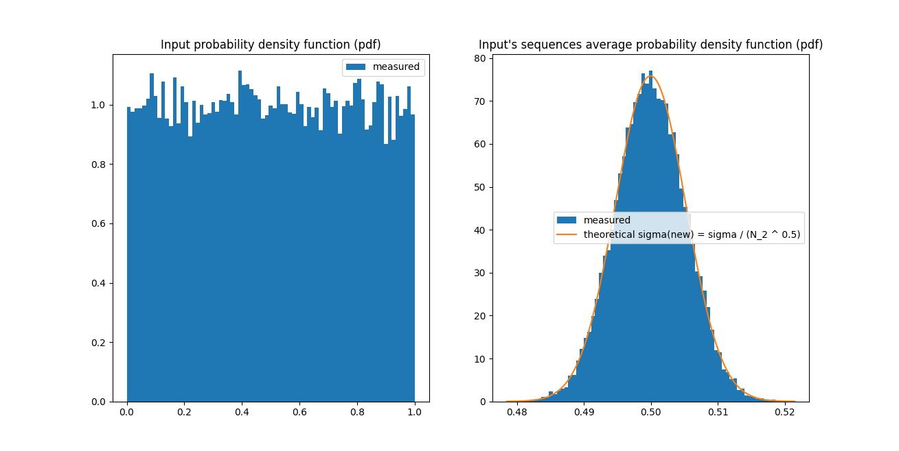
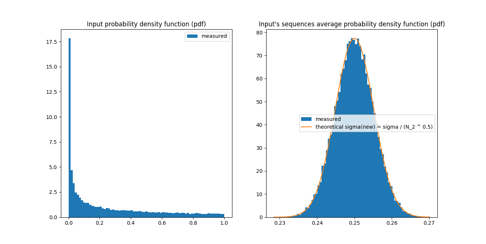
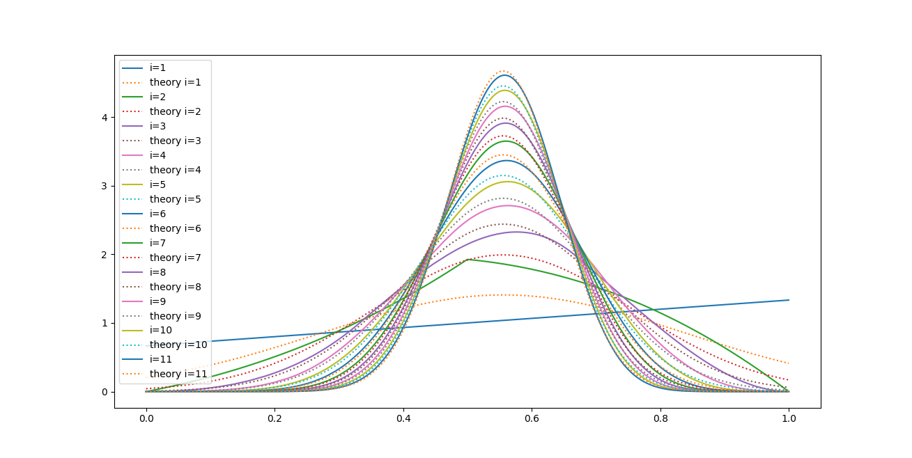
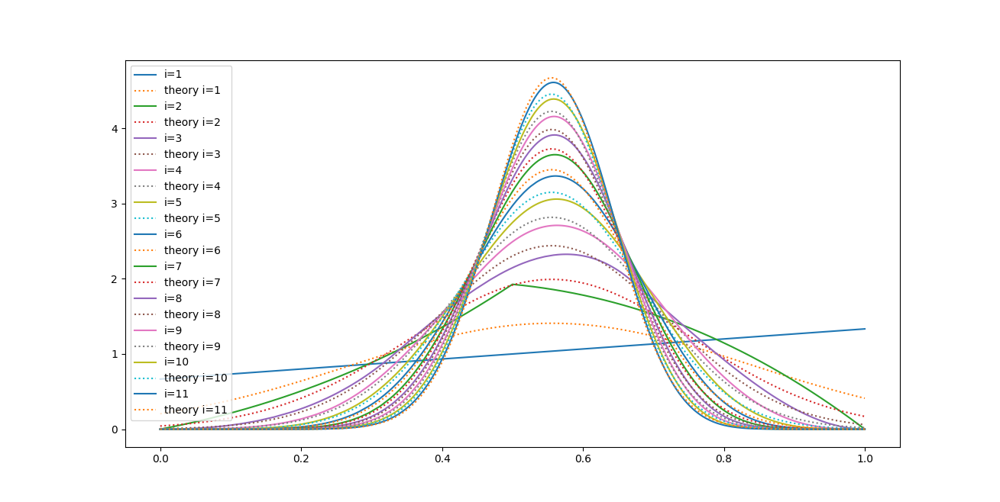

# [Central limit theorem](https://en.wikipedia.org/wiki/Central_limit_theorem)

Or as I call it - "Unexpected emergence of Gaussians out of everywhere :)" (main.py)

Left - Input (pdf) - [Continuous uniform distribution](https://en.wikipedia.org/wiki/Continuous_uniform_distribution)

Right - Output (pdf) - You take many of them (sequencies) and compute their averages, and those averages form a [Gaussian / Normal distribution](https://en.wikipedia.org/wiki/Normal_distribution):

Trippy, huh?

And it gets trippier - input can have any shape, not only uniform distribution, and the averages of the sequencies from input form again Gaussian / Normal distribution:

Or you can verify it through integrating over base distribution multiple times to see that it converges to Gaussian (main_dist_integral.py):

And one more example with integrating over base distribution verification:

Hans Fischer: [A History of the Central Limit Theorem](https://link.springer.com/book/10.1007/978-0-387-87857-7)
